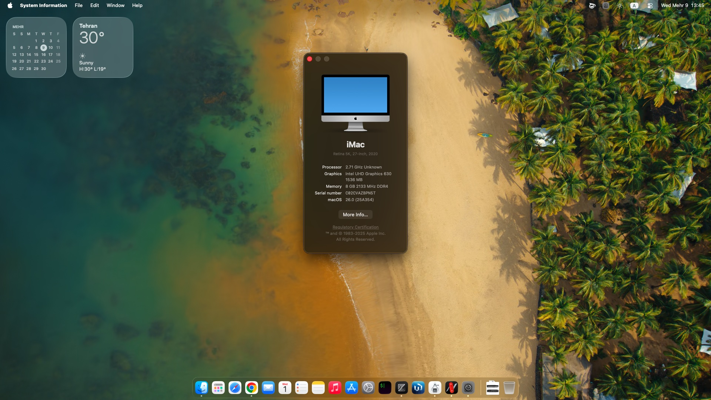
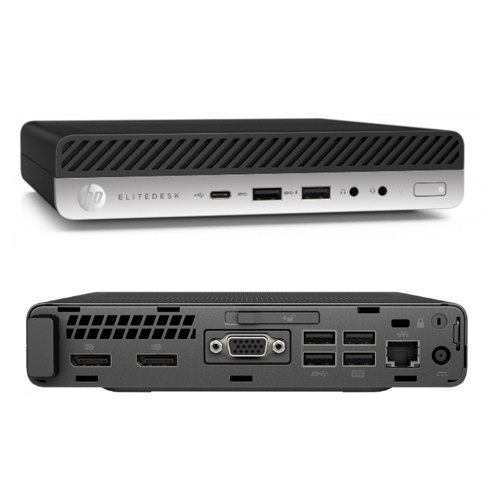

# 💻 Hackintosh – HP EliteDesk 800 G3 Mini

  

---

## ⚙️ Specs

- 🖥️ **CPU:** Intel Core i5-7500T
- 🎨 **iGPU:** Intel UHD 630 (3× DisplayPort)
- 🔒 **Intel ME:** v11
- 🧩 **Chipset:** Q270
- 🧠 **RAM:** Samsung M471A1G43EB1-CPB 8GB @ 2133 MHz
- 💾 **Storage:** Micron 2450 NVMe 256GB
- 🌐 **Ethernet:** Intel I219-LM
- 🎵 **Audio:** Conexant CX20632

---

## 🛠️ Build Info

- 🍏 **macOS:** Tahoe 26.0 (25A354)
- 🚀 **Bootloader:** OpenCore 1.0.6

---

  

## ✅ What Works / ❌ What Doesn’t

### ✅ Working
- Everything except the items below

### ❌ Not Working
- 📺 DRM (FairPlay, iTunes, Apple TV+)
- 🌙 Display wake from sleep

---

## 📌 Notes
- As you know Apple has remove **AppleHDA.kext** after Tahoe Beta 1 and you need to installed via <a herf="https://github.com/Mirone/MyKextInstaller">MyKextInstaller</as>. Note: You need to install KDK from **MyKextInstaller** first. The required configuration in OpenCore is already applied.
- Still testing **Intel ME** and **chipset details**. You can't use igfxfw=2 to force loading Apple GuC for higher clock rate of iGPU.
- Contributions and fixes welcome!

---

### ✨ Status Overview

| Feature       |Status|
|---------------|-----------------|
| CPU / iGPU    | ✅              |
| Ethernet      | ✅              |
| Audio         | ✅              |
| Sleep / Wake  | ⚠️ (Wake issue) |
| DRM           | ❌               |
| NVMe SSD      | ✅              |
| USB           | ✅              |

---

💡 *This repo documents a macOS Hackintosh build for the HP EliteDesk 800 G3 Mini. Not for production use.*
